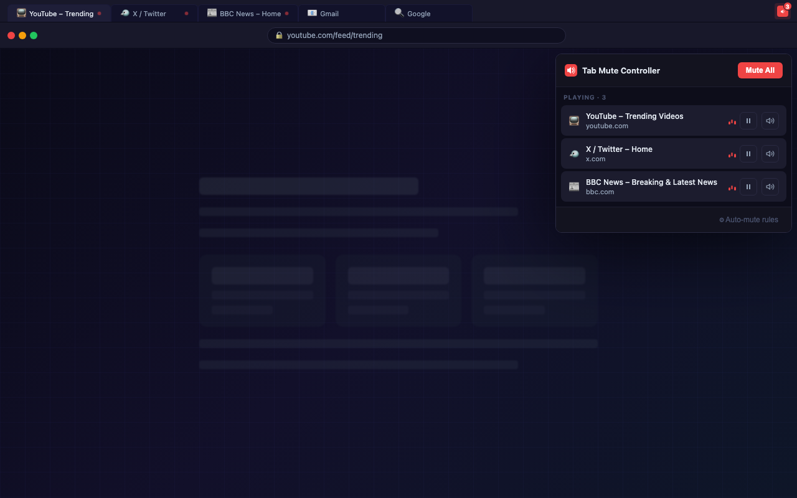
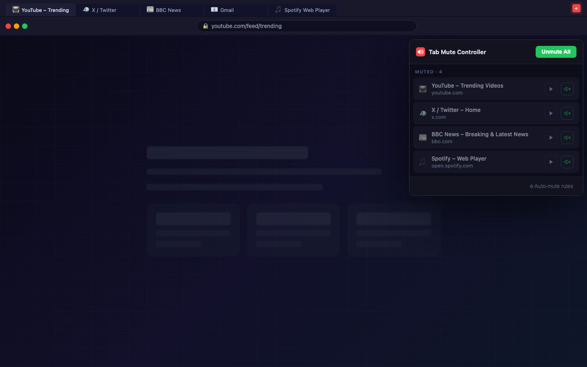
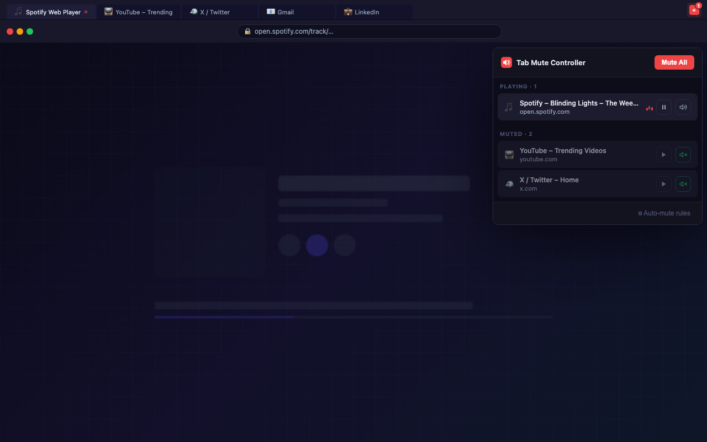
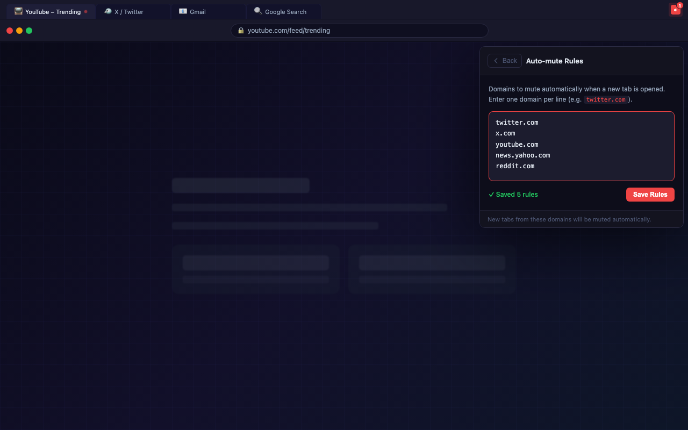

# Tab Mute Controller 🔇

> Instantly find and control tabs playing audio — mute, unmute, or pause any tab without switching to it.



---

## The Problem

You have 20+ tabs open. Suddenly audio starts blasting from somewhere. You spend 30 seconds hunting down which tab is making noise.

**Tab Mute Controller solves this in one click.**

---

## Features

- **Live badge** — toolbar icon shows the count of tabs currently playing audio
- **Instant discovery** — popup lists every audible tab with favicon, title, and domain
- **Per-tab controls** — mute/unmute or play/pause any tab without leaving your current tab
- **Mute All** — silence every playing tab at once (perfect for meetings)
- **Unmute All** — restore everything with one click
- **Auto-mute rules** — set domains that mute automatically when opened (e.g. `twitter.com`, `youtube.com`)
- **Live updates** — popup reflects audio state changes in real time

---

## Screenshots

| Playing tabs | Muted state |
|---|---|
|  |  |

| Mixed state | Auto-mute rules |
|---|---|
|  |  |

---

## Installation

### From the Chrome Web Store
*(Coming soon)*

### Load unpacked (developer mode)

1. Clone this repo
   ```bash
   git clone https://github.com/nyinyiz/Tab-Mute-Controller.git
   ```
2. Open Chrome and go to `chrome://extensions`
3. Enable **Developer mode** (top right toggle)
4. Click **Load unpacked**
5. Select the `tab-mute-controller` folder

---

## How to Use

1. Click the **Tab Mute Controller** icon in your toolbar
2. See all tabs producing audio listed instantly under **Playing**
3. Click **⏸** to pause media on a tab
4. Click **🔊** to mute a tab (audio keeps playing silently)
5. Click any tab row to jump directly to that tab
6. Hit **Mute All** to silence everything at once
7. Open **⚙ Auto-mute rules** to manage domain rules

---

## Permissions

| Permission | Why it's needed |
|---|---|
| `tabs` | Read tab titles, URLs, audio state, and mute/unmute tabs |
| `storage` | Save your auto-mute domain rules |
| `scripting` + `host_permissions` | Inject play/pause controls into tab pages |

No data is collected or transmitted. Everything stays in your browser.

---

## Project Structure

```
tab-mute-controller/
├── manifest.json       # Extension manifest (MV3)
├── background.js       # Service worker: badge updates + auto-mute
├── popup.html          # Extension popup UI
├── popup.css           # Dark theme styles
├── popup.js            # Popup logic
├── icons/              # PNG icons (16, 48, 128px)
└── screenshots/        # Chrome Web Store screenshots
```

---

## Development

Generate icons (requires Node.js, no extra dependencies):
```bash
node generate-icons.js
```

---

## License

MIT © [Nyi Nyi Zaw](https://github.com/nyinyiz)
